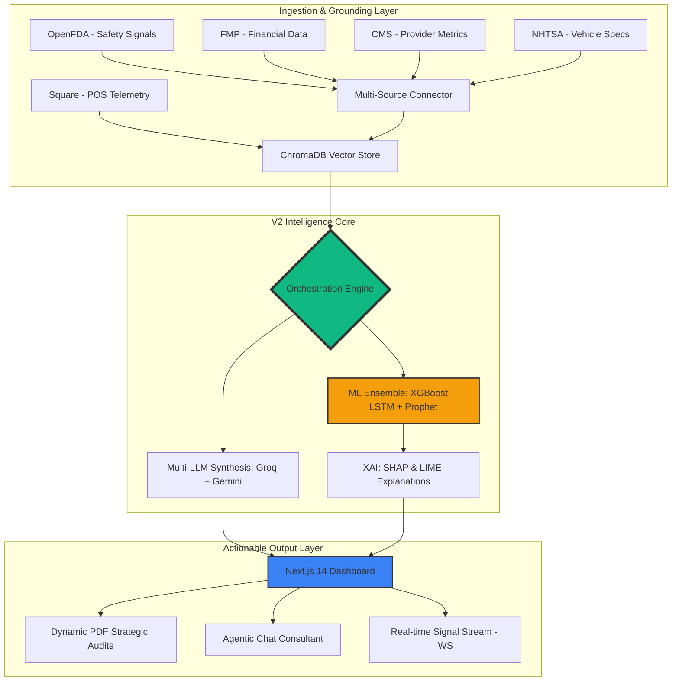

# ⚡ Vantage AI — V2 Strategic Intelligence Engine

An enterprise-grade, agentic platform for generating real-time strategic consultancy reports, analyzing competitive landscapes, and surfacing predictive financial models using RAG-grounded intelligence and Ensemble ML.

## 🚀 Overview
Vantage AI V2 transforms raw API signals from institutional sources (OpenFDA, FMP, CMS, HL7-FHIR, NHTSA, Square) into board-ready strategic intelligence. Using a **Staggered Multi-Pillar Synthesis** architecture combined with **Agentic RAG** and **Ensemble ML Forecasting**, the platform generates high-fidelity strategic audits that bridge the gap between technical data and executive decision-making.

## 📊 System Working & Flowchart

The system operates on an asynchronous "Fetch-and-Synthesize" pipeline, augmented by a vector knowledge base for industrial grounding and an ensemble of deep learning models for trend prediction.



## 🧠 Core Capabilities

### 1. Agentic RAG (Retrieval-Augmented Generation)
- **Vectorized Ingestion**: Multi-source data (Square POS, CMS) is vectorized into **ChromaDB**.
- **Contextual Grounding**: LLMs are grounded in real-time operational telemetry to avoid hallucinations.

### 2. Ensemble ML Forecasting
- **Multi-Model Prediction**: Combines XGBoost (Tabular), LSTM (Time-series), and Prophet (Forecasting) for high-accuracy growth trajectories.
- **Explainable AI (XAI)**: Integrated **SHAP** and **LIME** explainers provide transparency into model decision-making.

### 3. Staggered LLM Synthesis
- **Multi-Engine Orchestration**: Dynamically switches between **Groq (Llama-3.3-70B)** for sub-second speed and **Gemini 1.5 Pro/Flash** for complex reasoning.
- **Parallel Batching**: 7-dimensional strategic audits are generated in parallel using `asyncio` Task Groups.

## 🛠️ Tech Stack

### High-Performance Frontend
- **Framework**: Next.js 14 (App Router)
- **Styling**: Tailwind CSS with custom Glassmorphism tokens.
- **Real-time**: WebSocket integration for live signal feeds.
- **State Management**: React Query & Lucide Icons.

### Scalable Backend
- **Framework**: FastAPI (Asynchronous Orchestration)
- **Engines**: Groq (Primary), Gemini (Fallback).
- **Vector DB**: ChromaDB for RAG grounding.
- **ML Frameworks**: Scikit-learn, XGBoost, PyTorch (LSTM), Prophet.
- **Observability**: Sentry for error tracking and performance monitoring.

## 🏁 Getting Started

### Prerequisites
- Node.js (v18+)
- Python (3.10+)
- API Keys: Groq, Gemini, OpenFDA, FMP.

### Installation
1. **Clone & Install Backend**:
   ```bash
   cd backend
   python -m venv venv
   source venv/bin/activate
   pip install -r requirements.txt
   uvicorn main:app --reload
   ```

2. **Clone & Install Frontend**:
   ```bash
   cd frontend
   npm install
   npm run dev
   ```

---
*Created with Alpha Integrity · Built for the Future of Strategy*
